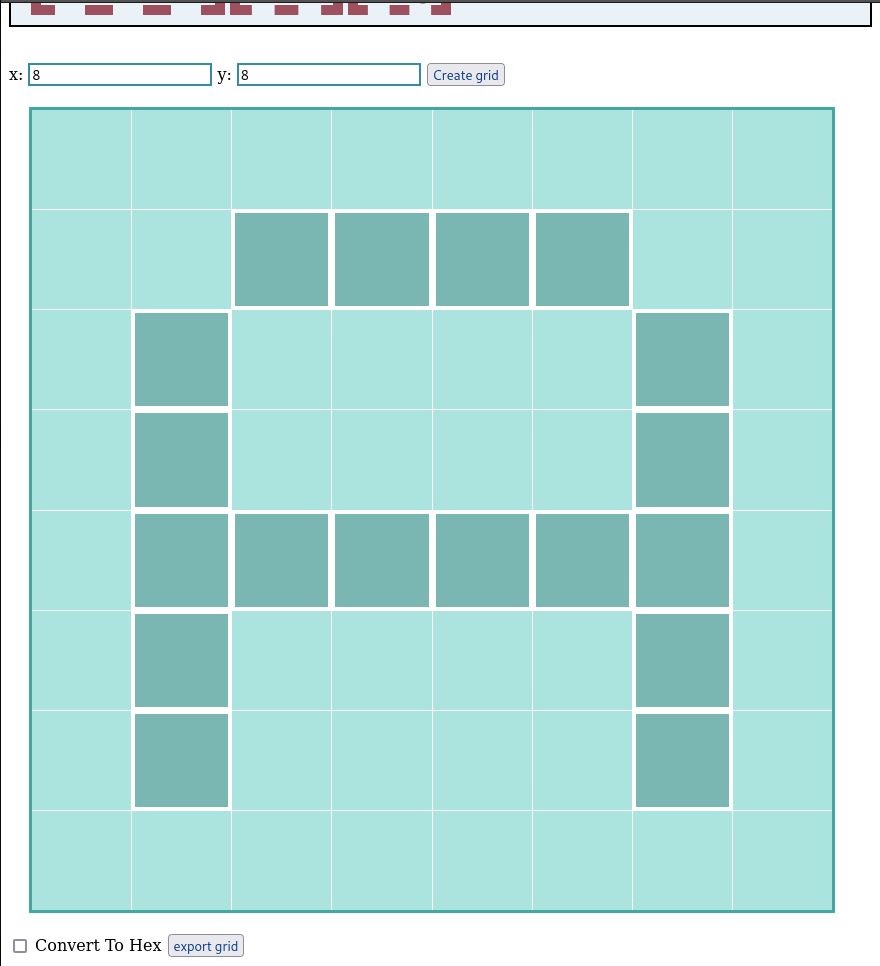
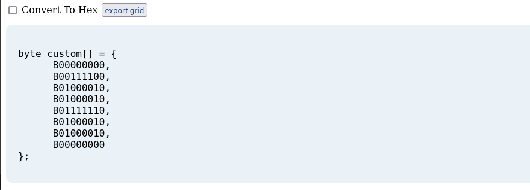
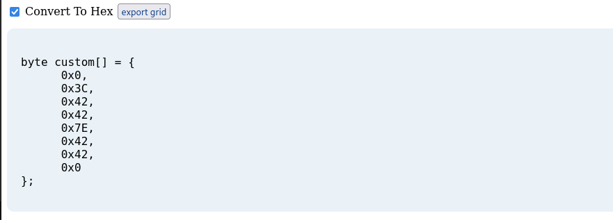

# bitmapping generator
I've worked with bitmaping for YonaOs fonts, and found out that the other devs use it also for LCDs, so I made one that's flexible for all of us;
## How To use
enter your grid size using X and Y field, play around and make your own monalisa in 16 bits ¯\\_(ツ)_/¯, then export it as binary by default or hex using the checkbox;

